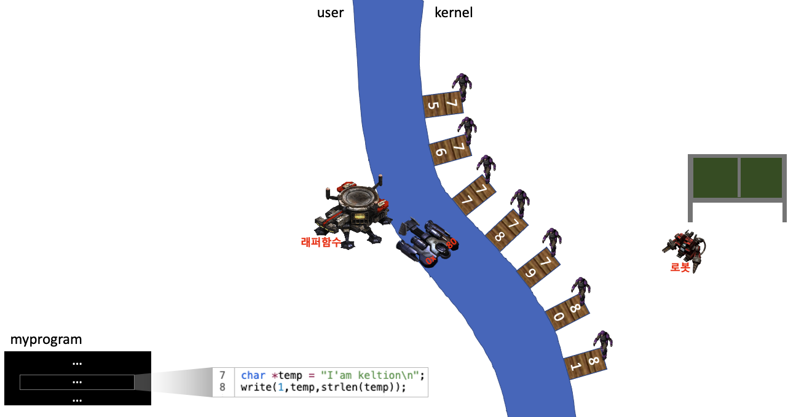

<!-- ---
title: "[운영체제] 시스템 콜"
layout: post
subtitle: systemcall
categories: class
tags: os
comments: false
--- -->

(완벽하게 작성된 글이 아닙니다)
# system call
시스템 콜에 대해서 알아보기 전에 하나의 스토리를 읽어보자

> kernel이라는 중립국은 게시판을 관리한다. user국에서 그 게시판에  "I’am keltion" 이라는 글을 쓰려고한다. 하지만 강에 의해서 막혀있기 때문에 글을 쓰기 위해서는 직접갈 수 없다. 따라서 우리는 수송선을 만드는 래퍼함수를 이용하기로 한다. 우리는 래퍼함수에게 어떤 글을 남길것인지(인자)를 전달해준다. 래퍼함수는 kernel로 넘어가기위해 수송선(interupt)을 보낸다. 하지만 아무 수송선이나 보내면 안된다. kernel국에서는 write, read, fork 등(시스템호출)의 일을 하기위해서는 80번 수송선을 80번 선착장에 있는 병사에게 보내야한다. 또한 보안상 kernel국에는 병사를 보낼 수 없다. 
>
> 여기서 의문이 든다. "우리의 말을 전달하는 병사를 보낼 수 없는데 인자를 어떻게 전달하고 우리가 게시판에 글을 쓸건지 글을 읽을건지 어떻게 알리지?"
> 간단하다. 이 세계에는 user와 kernel국이 공유하는 마법의 종이인 레지스터가 있다. user국에서 이 종이를 수정하면 kernel국에 있는 종이에 자동으로 수정이 반영된다! 따라서 우리는 수송선을 보내기전에 이 종이에 우리가 어떤 작업을 하는지 미리 작성하면된다. 
>
> 따라서 kernel국의 80번 선착장에 수송선이 도착하면 80번에 있는 병사는 이 문서를 보고 우리가 하고싶은 행동을 로봇에게 명령하면 된다.
>
> 80번 병사 : (수송선이 도착한걸보고 로봇에게 간 뒤 마법의 종이를 보며 게시판에 write하도록 명령한다)

사실 위 스토리는 응용프로그램에서 kernel mode에 있는 함수를 불렀을때 발생하는 프로세스를 풀어 설명한 것이다. user movde에 있는 함수가 kernel mode에 있는 함수를 부르려면 "call"명령어를 사용하면 안된다. 소프트웨어적인 인터럽트를 사용해서 잘 정의된 약속된 경로인(system call)로 들어가야한다. 응용프로그램(프로세스)은 이를 통해 자기대신 커널에게 어떤 동작을 수행하도록 요청할 수 있다.

이번에는 실제로 시스템 호출의 프로세스를 살펴보자.

응용프로그램이 kernel mode에 있는 함수를 실행해야하는 상황이라고 가정하자.
gos
1. 응용프로그램이 C라이브러리(glibc)의 래퍼 함수를 호출해서 시스템 호출을 한다.
> 래퍼함수란? : 우리는 응용프로그램에서 system call을 직접호출 하는 것이 아니다. glibc(GNU C Library)의 래퍼함수를 호출하는 것이고 이 함수 내에서 진짜 system call을 호출한다. 좀 더 자세히는 trap을 발생시켜 system call을 실행시킨다.

2. 래퍼 함수는 시스템 호출의 모든 인자를 시스템 호출 트랩을 처리하는 함수에게 전달해야 한다. 응용프로그램에서 전달한 인자는 스택을 통해 래퍼에게 전달되지만, 커널에게 전달하려면 래퍼에서는 이 인자를 다시 특정 레지스터에 넣어야 한다. 
> kernel에는 두가지 중요한 테이블 존재한다. 하나는 IDT(인터럽트가 발생하면 번호가 들어오고 그 인터럽트를 처리하기위한 핸들러(=trap handler)들이 들어가있음)이고 하나는 sys_call_table이다. sys_call_table에 시스템 호출 트랩을 처리하는 함수들이 등록되어있다. 

3. 모든 시스템 호출이 같은 방법으로 커널에 진입하므로, 커널은 시스템 호출을 식별하는 방법이 필요하다. 이를 위해 래퍼 함수는 시스템 호출 번호를 특정 CPU 레지스터(%eax)에 복사해놓는다.

4. 래퍼 함수는 트랩 기계어 명령(int 0x80)을 실행하고, 이는 프로세서를 사용자 모드에서 커널 모드로 전환해 시스템의 트랩 벡터 0x80이 가리키는 코드를 실행한다.

5. 0x80트랩을 처리하기 위해, 커널은 system_call()루틴(=시스템콜)을 호출한다. 이 핸들러는 작업을 처리하고 리턴값을 스택에 넣고 래퍼 함수로 돌아오면서, 동시에 프로세서도 사용자 모드로 되돌린다.

> ps. 프로세서의 모드가 바뀐다는 말이 잘 와닿지 않음 ㅠㅠ
> I/O를 사용하려고 하는 순간 커널은 CPU를 빼았는다. I/O를 하고 싶으면 커널이 가지고 있는 function에 부탁해
> 스타포트에서 마법의 종이를 작성하고, interupt 해서 모드를 올려 ( 타이밍들...)