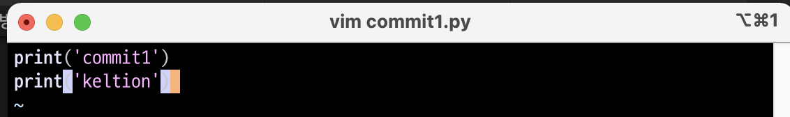
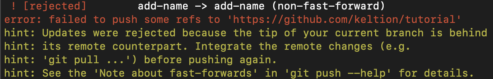
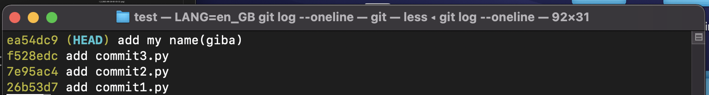
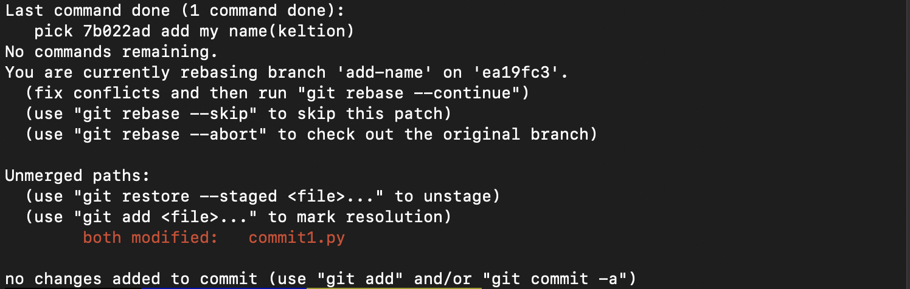

# rebase 하는 방법

## 상황
원격 저장소가 t1112222이고 branch가 master만 존재하는 상황에서 commit1.py에서 내 이름을 출력하는 함수를 추가해야하는 업무가 생겼다고 가정하자. 업무를 시작하기에 앞서 현재 히스토리를 확인해보자.
```console
git log --oneline
```
  

커밋이 3개가 존재하는 것을 확인할 수 있다. 이제 주어진 업무를 처리하기 위해서 add-name 브랜치를 생성해 줄 것이다.

```console
git checkout -b add-name
```
위 명령어로 인해 add-name 브랜치가 생성되고 현재 브랜치가 add-name으로 바뀔 것이다.
commit1.py를 확인해보자.
```console
cat commit1.py
```
  
원래 있던 print('commit1') 밑에 내 이름을 출력하는 함수를 추가하고 add 후에 커밋을 생성하자.
  

```console
git add commit1.py
git commit -m "add my name(keltion)"
```

커밋이 잘 들어갔는지 확인해보자.
```console
git log --oneline
```
  
"add commit3.py" 커밋 위에 잘 들어간걸 확인할 수 있다.

이제 원격저장소인 t1112222로 push를 하면 끝이다.
```console
git push t111222 add-name
``` 
  
그런데 충돌 메세지가 출력됐다. 위에서 확인한 "add commit3.py" 커밋 이후에 다른 commit을 누군가가 원격저장소에 올렸기 때문에 충돌이 발생한 것이다. 이를 해결하기 위해서는 내 커밋 이전의 커밋들을 현재 원격저장소에 있는 최신 커밋들로 업데이트해줘야한다. 어떤 절차를 걸쳐야할까??

## master에서 git pull
master 브랜치로 이동한 뒤에 pull로 원격저장소에 있는 히스토리를 땡겨 내 저장소에 있는 히스토리를 업데이트 해주자.
```console
git pull t1112222 master
```
pull이후 히스토리를 확인해보면 히스토리가 업데이트 된 것을 확인할 수 있다.
```console
git log --oneline
```
  

역시 "add commit3.py" 커밋 이후에 누군가가 "add my name(giba)" 커밋을 올렸다.

## add-name으로 돌아가 rebase
이제 다시 add-name으로 돌아가서 master에 업데이트한 히스토리를 add-name에 적용해주자.
```console
git rebase add-name
```
이때 충돌이 발생할 수도 있고 발생하지 않을 수도 있다. 내가 수정한 파일을 다른 누군가가 수정했다면 충돌이 발생한다. 이 예시에서는 충돌이 발생하도록 하였다. 
  

충돌을 해결하는 방법은 간단하다.
```console
git status
```
  
위 명령어를 통해 충돌난 파일을 확인하고 수정해주면 된다. 이 예시의 경우 commit1.py에서 충돌이 발생했다. 파일을 확인해보자
```console
vim commit1.py
```
  
확인 결과 giba라는 유저가 자신의 이름을 출력하도록 commit1.py를 수정하였다. 나와 같은 파일을 수정하였으므로 충돌이 난 것이었다. 이를 적절히 수정해주고 rebase --continue를 해주면 된다.
```console
git add commit1.py
git rebase --continue
````
이때 아래와 같이 다시 커밋 메세지를 작성하는 창이 뜨는데, 수정할 필요가 없으면 그냥 나오면 된다.
  

히스토리를 확인해보면
```console
git log --oneline
````
  
내 커밋이 잘 들어갔다는 걸 알 수 있다.


